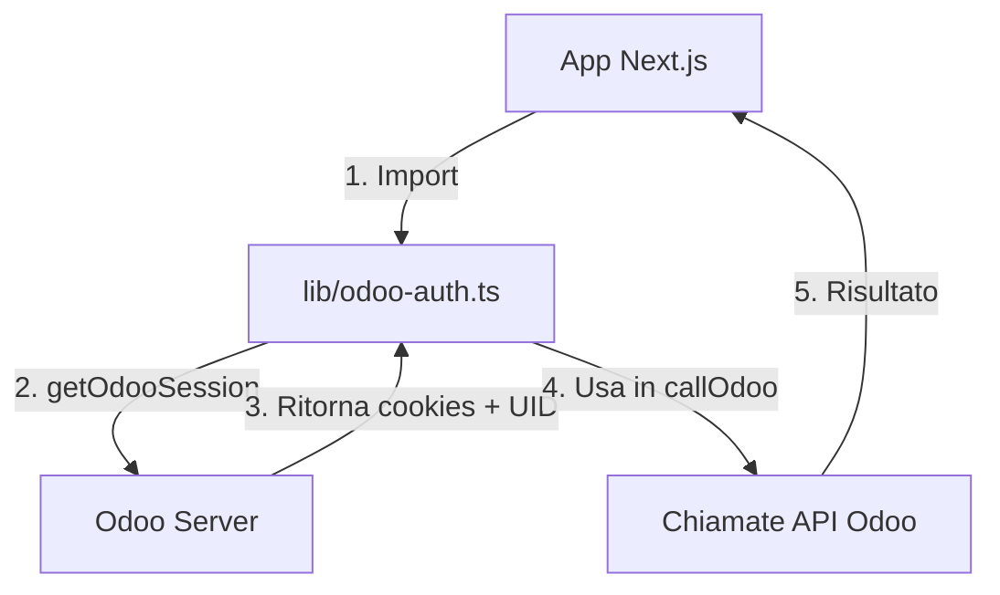

# 🔐 Guida Autenticazione Odoo per la Piattaforma

## 📋 Panoramica

Questa guida spiega come **TUTTE** le app della piattaforma devono autenticarsi con Odoo per effettuare chiamate API.

**REGOLA D'ORO:** Tutte le API usano lo stesso sistema di autenticazione centralizzato in `lib/odoo-auth.ts`

---

## 🎯 Come Funziona

### 1. File Helper Centralizzato

**Percorso:** `lib/odoo-auth.ts`

Questo file contiene:
- `getOdooSession()` - Autentica con Odoo e ritorna cookies + UID
- `callOdoo()` - Chiama metodi Odoo
- Credenziali Odoo centralizzate (paul@lapa.ch / lapa201180)

### 2. Variabili d'Ambiente

Nel file `.env.local`:

```env
ODOO_URL=https://lapadevadmin-lapa-v2-staging-2406-24063382.dev.odoo.com
ODOO_DB=lapadevadmin-lapa-v2-staging-2406-24063382
```

---

## 💻 Come Usarlo nelle API

### Template Base per Nuove API

```typescript
import { NextRequest, NextResponse } from 'next/server';
import { getOdooSession, callOdoo } from '@/lib/odoo-auth';

export async function GET(request: NextRequest) {
  try {
    // 1. Autentica con Odoo
    const { cookies, uid } = await getOdooSession();

    if (!uid) {
      return NextResponse.json(
        { error: 'Autenticazione fallita' },
        { status: 401 }
      );
    }

    // 2. Fai chiamate Odoo
    const risultato = await callOdoo(
      cookies,
      'nome.modello',  // es: 'stock.picking'
      'search_read',   // metodo Odoo
      [],              // args posizionali
      {                // kwargs
        domain: [['state', '=', 'done']],
        fields: ['id', 'name'],
        limit: 10
      }
    );

    // 3. Ritorna risultato
    return NextResponse.json({ success: true, data: risultato });

  } catch (error: any) {
    console.error('❌ Errore:', error);
    return NextResponse.json(
      { error: error.message },
      { status: 500 }
    );
  }
}
```

---

## 📝 Esempi Pratici

### Esempio 1: Leggere Dati da Odoo

```typescript
// app/api/products/route.ts
import { getOdooSession, callOdoo } from '@/lib/odoo-auth';

export async function GET() {
  const { cookies, uid } = await getOdooSession();

  const products = await callOdoo(
    cookies,
    'product.product',
    'search_read',
    [],
    {
      domain: [['sale_ok', '=', true]],
      fields: ['id', 'name', 'list_price', 'image_128'],
      limit: 50
    }
  );

  return NextResponse.json(products);
}
```

### Esempio 2: Scrivere Dati su Odoo

```typescript
// app/api/orders/create/route.ts
import { getOdooSession, callOdoo } from '@/lib/odoo-auth';

export async function POST(request: NextRequest) {
  const { cookies, uid } = await getOdooSession();
  const body = await request.json();

  const orderId = await callOdoo(
    cookies,
    'sale.order',
    'create',
    [{
      partner_id: body.partner_id,
      order_line: body.lines
    }]
  );

  return NextResponse.json({ success: true, order_id: orderId });
}
```

### Esempio 3: Chiamare Metodi Custom

```typescript
// app/api/delivery/validate/route.ts
import { getOdooSession, callOdoo } from '@/lib/odoo-auth';

export async function POST(request: NextRequest) {
  const { cookies, uid } = await getOdooSession();
  const { picking_id } = await request.json();

  // Chiama metodo button_validate su stock.picking
  const result = await callOdoo(
    cookies,
    'stock.picking',
    'button_validate',
    [[picking_id]]  // args come array
  );

  return NextResponse.json({ success: true, result });
}
```

---

## ⚠️ Errori Comuni da Evitare

### ❌ SBAGLIATO - Autenticazione diretta

```typescript
// NON FARE COSÌ!
const response = await fetch(`${ODOO_URL}/web/session/authenticate`, {
  method: 'POST',
  body: JSON.stringify({
    params: {
      login: 'paul@lapa.ch',  // Credenziali hardcoded sparse ovunque!
      password: 'lapa201180'
    }
  })
});
```

### ✅ CORRETTO - Usa helper centralizzato

```typescript
import { getOdooSession, callOdoo } from '@/lib/odoo-auth';

const { cookies, uid } = await getOdooSession();  // Una riga!
```

---

## 🔄 Flusso Completo



1. **Import** delle funzioni helper
2. **Autentica** con `getOdooSession()`
3. **Chiamata** con `callOdoo(cookies, ...)`
4. **Ritorna** risultato al client

---

## 📚 API Odoo Disponibili

### Metodi Comuni

| Metodo | Descrizione | Esempio |
|--------|-------------|---------|
| `search_read` | Cerca e leggi record | Prodotti, Clienti, Ordini |
| `create` | Crea nuovo record | Nuovo ordine |
| `write` | Aggiorna record | Modifica quantità |
| `unlink` | Elimina record | Cancella riga |
| `button_validate` | Chiama azione bottone | Valida consegna |

### Modelli Comuni

- `product.product` - Prodotti
- `res.partner` - Clienti/Fornitori
- `sale.order` - Ordini di vendita
- `stock.picking` - Consegne
- `stock.move.line` - Righe movimento
- `ir.attachment` - Allegati

---

## 🛠️ Troubleshooting

### Errore 401 Unauthorized

**Causa:** Autenticazione fallita

**Soluzione:**
```typescript
const { cookies, uid } = await getOdooSession();
if (!uid) {
  console.error('❌ Autenticazione fallita!');
  // Controlla credenziali in lib/odoo-auth.ts
}
```

### Errore "Odoo model not found"

**Causa:** Nome modello sbagliato

**Soluzione:** Verifica nome corretto in documentazione Odoo

### Session scaduta

**Causa:** Cookie scaduto

**Soluzione:** `getOdooSession()` crea sempre nuova sessione, nessun problema!

---

## 🎓 Best Practices

### ✅ DA FARE

1. **Importa sempre** da `@/lib/odoo-auth`
2. **Controlla uid** dopo autenticazione
3. **Gestisci errori** con try/catch
4. **Logga operazioni** con console.log
5. **Usa TypeScript** per type safety

### ❌ DA NON FARE

1. ~~Hardcode credenziali~~ nelle API
2. ~~Crea sessioni multiple~~ per stessa richiesta
3. ~~Ignora errori~~ Odoo
4. ~~Cookie management manuale~~
5. ~~Fetch diretti~~ a Odoo senza helper

---

## 📞 Supporto

Per domande o problemi:

1. Leggi questa guida
2. Controlla file `lib/odoo-auth.ts`
3. Vedi esempi in `app/api/delivery/`
4. Consulta log errori console

---

## 🔄 Changelog

- **2025-01-03**: Creazione guida centralizzata
- Helper unificato in `lib/odoo-auth.ts`
- Migrazione API delivery

---

**RICORDA:** Un solo file helper, infinite possibilità! 🚀
