# 🤖 Product Creator AI

App intelligente per la creazione automatica di prodotti in Odoo a partire dalle fatture.

## 🚀 Funzionalità

### 1. **Upload Fattura**
- Supporta PDF e immagini (JPG, PNG)
- Upload drag & drop
- Validazione automatica del file

### 2. **Parsing AI con Claude Vision**
- Estrazione automatica di tutti i prodotti dalla fattura
- Riconoscimento di:
  - Nome prodotto
  - Codice/EAN
  - Quantità
  - Prezzo unitario
  - Unità di misura
  - Note

### 3. **Selezione Prodotti**
- Interfaccia intuitiva per selezionare quali prodotti creare
- Preview di tutti i dati estratti
- Statistiche in tempo reale

### 4. **Arricchimento Automatico con AI**
- **Claude AI** arricchisce ogni prodotto con:
  - Nome completo ottimizzato
  - Descrizione breve per listing
  - Descrizione dettagliata
  - Categoria e sottocategoria
  - Marca/Brand
  - Prezzo di vendita suggerito (con margine)
  - Caratteristiche tecniche
  - Tags per ricerca
  - Peso e dimensioni stimati

- **Web search** per informazioni aggiuntive (Wikipedia API)
- Possibilità di **modificare manualmente** ogni campo prima della creazione

### 5. **Creazione in Odoo**
- Creazione batch di tutti i prodotti selezionati
- Integrazione completa con Odoo ERP
- Report dettagliato di successi/errori

## 🛠️ Setup

### 1. Installare le dipendenze
```bash
npm install @anthropic-ai/sdk
```

### 2. Configurare l'API Key di Anthropic
Aggiungi al tuo file `.env.local`:
```env
ANTHROPIC_API_KEY=your-anthropic-api-key-here
```

Ottieni la tua API key su: https://console.anthropic.com/

### 3. Verificare la configurazione Odoo
Assicurati che siano configurati:
```env
ODOO_URL=your-odoo-url
ODOO_DB=your-odoo-database
```

## 📂 Struttura del Codice

```
app-hub-platform/
├── app/
│   ├── product-creator/
│   │   ├── page.tsx                    # Upload fattura
│   │   └── select-products/
│   │       └── page.tsx                # Selezione e arricchimento
│   └── api/
│       └── product-creator/
│           ├── parse-invoice/
│           │   └── route.ts            # API parsing con Claude Vision
│           ├── enrich-product/
│           │   └── route.ts            # API arricchimento con AI + web
│           └── create-products/
│               └── route.ts            # API creazione in Odoo
└── lib/
    └── data/
        └── apps-with-indicators.ts     # Registrazione app nel menu
```

## 🎯 Flusso Utente

```mermaid
graph TD
    A[Upload Fattura] --> B[Claude Vision estrae prodotti]
    B --> C[Mostra prodotti estratti]
    C --> D[Utente seleziona prodotti]
    D --> E[Click su Arricchisci]
    E --> F[Claude AI + Web Scraping]
    F --> G[Mostra dati arricchiti]
    G --> H[Utente può modificare]
    H --> I[Click su Crea in Odoo]
    I --> J[Prodotti creati in Odoo]
```



## 🔧 API Endpoints

### POST `/api/product-creator/parse-invoice`
Analizza la fattura e estrae i prodotti.

**Input:** FormData con file `invoice`

**Output:**
```json
{
  "success": true,
  "data": {
    "fornitore": "Nome Fornitore",
    "numero_fattura": "FT-2025-001",
    "data_fattura": "2025-10-01",
    "prodotti": [
      {
        "nome": "Prodotto 1",
        "codice": "EAN123",
        "quantita": 10,
        "prezzo_unitario": 5.50,
        "prezzo_totale": 55.00,
        "unita_misura": "PZ"
      }
    ]
  }
}
```

### POST `/api/product-creator/enrich-product`
Arricchisce un singolo prodotto con AI.

**Input:**
```json
{
  "product": {
    "nome": "Prodotto 1",
    "codice": "EAN123",
    "prezzo_unitario": 5.50
  },
  "additionalInfo": "Informazioni aggiuntive facoltative"
}
```

**Output:**
```json
{
  "success": true,
  "data": {
    "nome_completo": "Prodotto 1 - Descrizione Completa",
    "descrizione_breve": "Breve descrizione del prodotto",
    "descrizione_dettagliata": "Descrizione completa con caratteristiche...",
    "categoria": "Alimentari > Bevande",
    "marca": "Brand",
    "codice_ean": "EAN123",
    "prezzo_vendita_suggerito": 8.25,
    "caratteristiche": ["Caratteristica 1", "Caratteristica 2"],
    "tags": ["tag1", "tag2"],
    "peso": 0.5,
    "dimensioni": "10x10x15 cm"
  }
}
```

### POST `/api/product-creator/create-products`
Crea prodotti in batch in Odoo.

**Input:**
```json
{
  "products": [
    {
      "nome_completo": "...",
      "descrizione_breve": "...",
      "prezzo_vendita_suggerito": 8.25,
      // ... altri campi
    }
  ]
}
```

**Output:**
```json
{
  "success": true,
  "summary": {
    "total": 10,
    "created": 9,
    "failed": 1
  },
  "results": [...],
  "errors": [...]
}
```

## 🎨 UI/UX Features

- ✅ Design responsive (mobile-first)
- ✅ Animazioni fluide con Framer Motion
- ✅ Feedback real-time con toast notifications
- ✅ Stati di caricamento chiari
- ✅ Possibilità di modificare i dati prima della creazione
- ✅ Visualizzazione espandibile dei dettagli prodotto
- ✅ Selezione multipla con checkbox
- ✅ Statistiche in tempo reale

## 💡 Tips per l'Uso

1. **Qualità delle fatture**: Usa immagini/PDF chiari per risultati migliori
2. **Review dei dati**: Controlla sempre i dati estratti prima di creare i prodotti
3. **Informazioni aggiuntive**: Puoi fornire info extra durante l'arricchimento per migliorare la qualità
4. **Batch creation**: Puoi creare fino a 100 prodotti alla volta

## 🔐 Sicurezza

- ✅ Autenticazione richiesta
- ✅ Validazione file lato client e server
- ✅ Limite dimensione file (10MB)
- ✅ API key Anthropic protetta server-side
- ✅ Rate limiting consigliato per produzione

## 📊 Costi

- **Claude 3.5 Sonnet**: ~$3 per 1M input tokens, ~$15 per 1M output tokens
- **Stima per fattura media**:
  - Parsing: ~500 tokens input + 1000 tokens output = $0.016
  - Arricchimento per prodotto: ~300 tokens input + 500 tokens output = $0.009
  - **Totale per 10 prodotti**: ~$0.10

## 🚀 Future Improvements

- [ ] Supporto multi-lingua
- [ ] OCR migliorato per fatture scannerizzate
- [ ] Template personalizzabili per categorie
- [ ] Import immagini prodotto da URL
- [ ] Integrazione con database fornitori
- [ ] Suggerimento prezzi basato su storico
- [ ] Batch upload di multiple fatture
- [ ] Export/import configurazioni

## 📞 Supporto

Per problemi o domande:
- Verifica che l'API key Anthropic sia configurata correttamente
- Controlla i log del server per errori dettagliati
- Verifica la connessione con Odoo

---

**Creato con ❤️ usando Claude AI**
