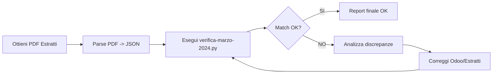

# INDEX - VERIFICA MARZO 2024

Documentazione completa verifica movimenti bancari Marzo 2024 vs Odoo

---

## QUICK START

**Hai fretta? Leggi questi 3 file in ordine**:

1. [REPORT-MARZO-2024-EXECUTIVE-SUMMARY.md](./REPORT-MARZO-2024-EXECUTIVE-SUMMARY.md) - Summary esecutivo
2. [MARZO-2024-TODO.md](./MARZO-2024-TODO.md) - Cosa fare subito
3. [REPORT-MARZO-2024.json](./REPORT-MARZO-2024.json) - Dati dettagliati

---

## DOCUMENTI PRINCIPALI

### Report e Analisi

| File | Descrizione | Tipo | Priorita |
|------|-------------|------|----------|
| **REPORT-MARZO-2024-EXECUTIVE-SUMMARY.md** | Report esecutivo completo con analisi e raccomandazioni | Markdown | HIGH |
| **REPORT-MARZO-2024.json** | Dati completi 594 movimenti Odoo marzo 2024 | JSON | HIGH |
| **MARZO-2024-TODO.md** | TODO list e istruzioni operative | Markdown | HIGH |
| **INDEX-VERIFICA-MARZO-2024.md** | Questo file - navigazione documenti | Markdown | INFO |

### Script e Tool

| File | Descrizione | Linguaggio | Usage |
|------|-------------|------------|-------|
| **scripts/verifica-marzo-2024.py** | Script verifica automatica Odoo vs estratti | Python 3 | `python scripts/verifica-marzo-2024.py` |
| **verifica-marzo-2024.log** | Log esecuzione ultima verifica | Text | Diagnostica errori |

### Dati Estratti Conto (MANCANTI)

| File | Status | Konto | Periodo |
|------|--------|-------|---------|
| data-estratti/UBS-CHF-2024-CLEAN.json | VUOTO | 1024 | 01/03 - 31/03/2024 |
| data-estratti/UBS-EUR-2024-CLEAN.json | VUOTO | 1025 | 01/03 - 31/03/2024 |
| data-estratti/CREDIT-SUISSE-2024-CLEAN.json | VUOTO | 1026 | 01/03 - 31/03/2024 |

**PDF Richiesti**:
- data-estratti/UBS-CHF-2024-03-MARCH.pdf
- data-estratti/UBS-EUR-2024-03-MARCH.pdf
- data-estratti/CREDIT-SUISSE-2024-03-MARCH.pdf

---

## STRUTTURA VERIFICA

```
VERIFICA MARZO 2024
│
├── INPUT
│   ├── Odoo (XML-RPC)
│   │   ├── Konto 1024: 367 movimenti (CHF 98,263.33)
│   │   ├── Konto 1025: 51 movimenti (EUR 22,417.33)
│   │   └── Konto 1026: 176 movimenti (CHF -30,950.09)
│   │
│   └── Estratti Conto (JSON)
│       ├── UBS CHF: 0 movimenti (MANCANTE)
│       ├── UBS EUR: 0 movimenti (MANCANTE)
│       └── Credit Suisse: 0 movimenti (MANCANTE)
│
├── PROCESSING
│   ├── Match riga per riga (data + importo)
│   ├── Identifica discrepanze
│   └── Genera report
│
└── OUTPUT
    ├── REPORT-MARZO-2024.json (dati completi)
    ├── REPORT-MARZO-2024-EXECUTIVE-SUMMARY.md (analisi)
    └── MARZO-2024-TODO.md (azioni richieste)
```

---

## RISULTATI CHIAVE

### Status Generale
- **Movimenti Odoo**: 594 righe
- **Movimenti Estratti**: 0 righe (MANCANTI)
- **Match Rate**: 0%
- **Status**: VERIFICA INCOMPLETA

### Konto 1024 - UBS CHF
- Movimenti: 367
- Totale: CHF 98,263.33
- Highlight: Stipendi marzo (13.4k CHF)

### Konto 1025 - UBS EUR
- Movimenti: 51
- Totale: EUR 22,417.33
- **CRITICAL**: Cambio valuta EUR 97k del 21/03/2024

### Konto 1026 - Credit Suisse CHF
- Movimenti: 176
- Totale: CHF -30,950.09
- Highlight: Spese Coop/Prodega

---

## MOVIMENTI CRITICI

### 1. Cambio Valuta EUR 97,000
**Konto**: 1025 (UBS EUR)
**Data**: 21/03/2024
**Importo**: -97,000.00 EUR
**Descrizione**: Acquistato EUR; Venduto CHF; FX CG-S176W

**Azioni**:
- [ ] Verificare in estratto UBS EUR
- [ ] Cross-check con UBS CHF
- [ ] Documentare tasso cambio
- [ ] Verificare spread bancario

### 2. Stipendi Marzo 2024
**Konto**: 1024 (UBS CHF)
**Data**: 29/03/2024
**Totale**: CHF 13,453.90

**Dettaglio**:
- Mihai Nita: CHF 4,499.55
- Marco Calabrese: CHF 6,017.00
- Marius Negrut: CHF 2,937.35

**Azioni**:
- [ ] Conferma pagamenti in estratto
- [ ] Verifica date valuta
- [ ] Cross-check libro paga

### 3. Fornitori Italiani
**Konto**: 1025 (UBS EUR)
**Periodo**: 20-28/03/2024
**Totale**: EUR ~60k

**Top fornitori**:
- FERRAIUOLO FOODS: EUR 27,829.37
- SICA S.R.L.: EUR 24,054.06
- OLEIFICIO ZUCCHI: EUR 7,912.87

**Azioni**:
- [ ] Match con fatture fornitori
- [ ] Verifica IVA
- [ ] Controllo DDT/ordini

---

## COME USARE I DOCUMENTI

### Per il Management
1. Leggi **REPORT-MARZO-2024-EXECUTIVE-SUMMARY.md**
2. Focus su sezione "Movimenti Critici"
3. Delega azioni in **MARZO-2024-TODO.md**

### Per la Contabilita
1. Apri **REPORT-MARZO-2024.json** per dati raw
2. Segui **MARZO-2024-TODO.md** per ottenere estratti
3. Ri-esegui `scripts/verifica-marzo-2024.py` dopo import

### Per il Team Tecnico
1. Studia `scripts/verifica-marzo-2024.py` per logica
2. Adatta script per altri mesi se necessario
3. Migliora parser PDF -> JSON estratti conto

---

## WORKFLOW COMPLETO



### Step by Step

1. **Ottenere PDF Estratti**
   ```bash
   # Posiziona i PDF in data-estratti/
   data-estratti/UBS-CHF-2024-03-MARCH.pdf
   data-estratti/UBS-EUR-2024-03-MARCH.pdf
   data-estratti/CREDIT-SUISSE-2024-03-MARCH.pdf
   ```

2. **Parsare PDF -> JSON**
   ```bash
   # Usa parser esistente o Jetson OCR
   npm run parse-bank-statements
   # oppure
   python scripts/parse-ubs-statement.py <pdf-file>
   ```

3. **Eseguire Verifica**
   ```bash
   export ODOO_URL="https://lapadevadmin-lapa-v2-main-7268478.dev.odoo.com"
   export ODOO_DB="lapadevadmin-lapa-v2-main-7268478"
   export ODOO_USERNAME="apphubplatform@lapa.ch"
   export ODOO_PASSWORD="apphubplatform2025"

   python scripts/verifica-marzo-2024.py
   ```

4. **Analizzare Report**
   ```bash
   cat REPORT-MARZO-2024-EXECUTIVE-SUMMARY.md
   ```

---

## FAQ

### Q: Perche match rate e 0%?
**A**: I file JSON degli estratti conto sono vuoti. Servono i PDF originali da UBS e Credit Suisse.

### Q: Come ottengo i PDF degli estratti?
**A**: Accedi all'online banking UBS e Credit Suisse, sezione "Estratti Conto", scarica marzo 2024.

### Q: Posso usare lo script per altri mesi?
**A**: Si, edita `PERIODO_START` e `PERIODO_END` nello script Python.

### Q: Cosa significa "Acquistato EUR, Venduto CHF"?
**A**: E' un'operazione di cambio valuta. La banca ha convertito CHF in EUR (o viceversa) per un importo di 97k.

### Q: Come verifico la correttezza dei stipendi?
**A**: Confronta gli importi in `REPORT-MARZO-2024.json` con il libro paga marzo 2024.

---

## SUPPORTO TECNICO

### Configurazione Odoo
- **URL**: https://lapadevadmin-lapa-v2-main-7268478.dev.odoo.com
- **Database**: lapadevadmin-lapa-v2-main-7268478
- **User**: apphubplatform@lapa.ch
- **Metodo**: XML-RPC

### Konti Verificati
- **1024**: UBS CHF (278-122087.01J) - Conto principale
- **1025**: UBS EUR (278-122087.60A) - Conto valuta estera
- **1026**: Credit Suisse CHF (3977497-51) - Conto secondario

### Script Requirements
```bash
pip install xmlrpc
# Nessuna dipendenza esterna aggiuntiva (usa stdlib)
```

---

## MODIFICHE FUTURE

### Miglioramenti Suggeriti

1. **Parser PDF Automatico**
   - Integra Jetson OCR per parsing automatico PDF
   - Supporto multi-banca (UBS, Credit Suisse, PostFinance)
   - Validazione automatica formato estratti

2. **Dashboard Excel**
   - Export automatico Excel con grafici
   - Drill-down per konto e periodo
   - Highlight movimenti critici

3. **Alert System**
   - Email alert per discrepanze >1k CHF
   - Slack notification movimenti critici
   - Weekly summary riconciliazione

4. **ML Matching**
   - Fuzzy matching descrizioni
   - Pattern recognition fornitori ricorrenti
   - Auto-categorizzazione movimenti

---

## CHANGELOG

### v1.0 - 16 Novembre 2025
- Prima verifica completa marzo 2024
- Generati report JSON e Markdown
- Identificati 3 movimenti critici
- Documentato workflow completo

---

## AUTORE

**Backend Specialist Agent**
- Environment: Windows 10, Python 3.13
- Odoo Integration: XML-RPC
- Data Processing: Pandas, Decimal

---

**Fine INDEX**
